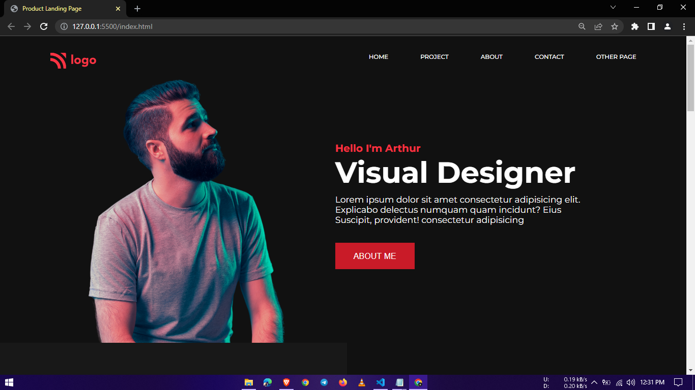

# 15-Portfolio-landing-page
It is part of the Full Stack Javascript Bootcamp being taught at ineuron.ai by Hitesh Choudhary Sir.

## Project 15 [Live Link](https://portfolio-landing-pagess.netlify.app/)

-   During this project, I gained the following skills:
    -   I learned how to create background box for visual design.
    -   I learned how to use external fontawesome icon library
    -   I learned indepth knowledge of flexbox
---

## Time taken to finish this project

-   3 hour to complete it.

#### Screenshot

